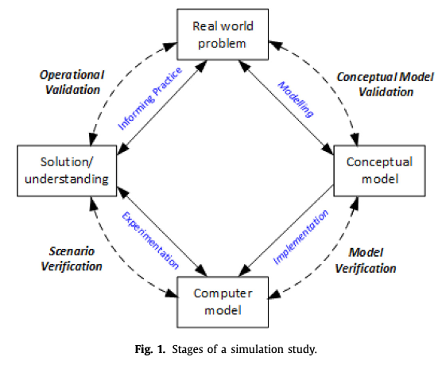

## [Content](#content)

<table>
<tr><td colspan="2"><a href="#related-research-papers-in-or">Related research papers in OR</a></td></tr>
<tr><td colspan="2">&emsp;<a href="#building-digital-models">Building digital models</a></td></tr>
<tr>
	<td>&emsp;&emsp;<a href=#simulation-models>Simulation models</a></td>
	<td>&emsp;&emsp;<a href=#data-driven-modeling>Data driven modeling</a></td>
</tr>
<tr>
	<td>&emsp;&emsp;<a href=#integrating-models>Integrating models</a></td>
	<td>&emsp;&emsp;<a href=#trust-issue>Trust issue</a></td>
</tr>
<tr>
	<td>&emsp;&emsp;<a href=#automatically-generating-simulation-models>Automatically generating simulation models</a></td>
	<td>&emsp;&emsp;<a href=#mixed-modeling>Mixed quantitative and qualitative modeling</a></td>
</tr>
<tr>
	<td>&emsp;&emsp;<a href=#interoperability>Interoperability</a></td>
</tr>
</table>

[Back to homepage](../papers4dtor.md)

## [Building digital models](#content)

### [Simulation models](#content)
1. **Verification of Computer Simulation Models**. Management Science, 1967. [paper](https://doi.org/10.1287/mnsc.14.2.B92). *Thomas H. Naylor, J. M. Finger*

2. **Hybrid simulation modelling in operational research: A state-of-the-art review**. EJOR, 2018. [paper](https://doi.org/10.1016/j.ejor.2018.10.025). *Sally C. Brailsford , Tillal Eldabi , Martin Kunc , Navonil Mustafee , Andres F. Osorio*. 

> Simulation approaches in manufacturing and business: discrete-event simulation (DES), system dynamics (SD) and agent-based simulation (ABS) 

> An increasing interest in hybrid simulation (defined as models that combined at least two of these approaches) to model complex enterprise-wide systems.

> Bennett (1985) discusses three levels at which different OR methods could be combined. The lowest level, Comparison, involves using two or more methods entirely separately for the purpose of solving different aspects of a problem which could not be tackled by any one method on its own. The next level, Enrichment, aims to enhance one method (the main method) by using elements of another. The highest level, Integration, treats the methods on an equal footing and uses elements of each to generate something to- tally new.

> Most real-world problems and systems are complex, with many different features and characteristics, and very rarely is one single method ideally suited to capture all of them. The modeller who chooses to use only one method is therefore faced with a dilemma: to model the whole problem using one single method, accepting that it makes invalid assumptions or oversimplifies some aspects, or to model only those parts of the problem for which their chosen method is suitable and simply say that the remaining parts are out of scope? The former approach may lead to poor solutions (and bad decisions), but from a practical perspective it may be neither useful nor sensible to study only one aspect of a real-world problem in isolation. This dilemma has also driven the need for hybrid simulation.

> We originally hypothesised that hybrid simulation approaches have become more popular because modern business problems are more complex. However, it may be that business problems were always complex, and simulation modellers have simply become more ambitious about the types of problem that can be tackled. Either way, hybrid simulation is clearly here to stay.

 

3. **Introduction to Discrete Event Systems**. [book](https://link.springer.com/book/10.1007/978-0-387-68612-7). *Christos G. CassandrasStéphane Lafortune*

4. **The Object-Oriented discrete event simulation modeling: A case study on aircraft spare part management**. WSC, 2015. [paper](https://ieeexplore.ieee.org/document/7408511). *Haobin Li; Yinchao Zhu; Yixin Chen; Giulia Pedrielli; Nugroho A. Pujowidianto*

5. **Tutorial on agent-based modeling and simulation**. WSC, 2005. [paper](https://ieeexplore.ieee.org/abstract/document/1574234). *C.M. Macal; M.J. North*.

6. **Agent-based modeling and simulation**. WSC, 2009. [paper](https://ieeexplore.ieee.org/abstract/document/5429318). *C.M. Macal; M.J. North*.

7. **Introductory Tutorial: Agent-based Modeling And Simulation**. WSC, 2014. [paper](https://ieeexplore.ieee.org/abstract/document/7019874). *C.M. Macal; M.J. North*.

8. **System Dynamics Modeling: Tools for Learning in a Complex World**. California Management Review, 2001. [paepr](https://doi.org/10.2307/41166098. *John D. Sterman*. 

9. **A tutorial on conceptual modeling for simulation**.  Proceedings ofthe 2015 Winter Simulation Conference, 2015. [paper](https://ieeexplore.ieee.org/document/7408298). *Stewart Robinson*

### [Data-driven modeling](#content)
1. **Particle Methods for Data-Driven Simulation and Optimization**. In INFORMS TutORials in Operations Research, 2012. [paper](https://doi.org/10.1287/educ.1120.0104). *John R. Birge*. 

> Particle methods have become a common approach to estimate the distribution of an unknown state in a Markov process (i.e., a hidden Markov model) from noisy observations with general nonlinear transitions. 

2. **Maximum Likelihood Estimation by Monte Carlo Simulation: Toward Data-Driven Stochastic Modeling**. Operations Research, 2020. [paper](https://doi.org/10.1287/opre.2019.1978). *Yijie Peng, Michael C. Fu, Bernd Heidergott, Henry Lam*

> -  We propose a new method for estimating un- known parameters of a stochastic model without assuming an analytical likelihood function.
> - We directly fit the underlying stochastic model to the output data, which opens the possibility of extending data-driven ideas to causal stochastic models.
> - We generalize our scheme to efficiently utilize the simulated samples in calculating the MLE for an HMM.

3. **Learning to simulate**. ICLR, 2019. [paper](https://arxiv.org/abs/1810.02513). *Nataniel Ruiz, Samuel Schulter, Manmohan Chandraker*

4. **Learning to Simulate Vehicle Trajectories from Demonstrations**. 2020 IEEE 36th International Conference on Data Engineering (ICDE). [paper](https://ieeexplore.ieee.org/document/9101553). *Guanjie Zheng; Hanyang Liu; Kai Xu; Zhenhui Li*.

### [Integrating models](#content)
1. **Symbiotic Simulation Systems: An Extended Definition Motivated by Symbiosis in Biology**. 22nd Workshop on Principles of Advanced and Distributed Simulation, 2008. [paper](https://ieeexplore.ieee.org/document/4545331). *Heiko Aydt, Stephen John Turner, Wentong Cai, Malcolm Yoke Hean Low* 

> We define a symbiotic simulation system as a close association between a simulation system and a physical system.
> However, control feedback to the physical system is optional. (closed-loop and open-loop)
> - (closed-loop) symbiotic simulation decision support system: indirectly influences the physical system
> - symbiotic simulation control system: directly influences the physical system
> - (open-loop) symbiotic simulation forecasting system: forecast the behavior of the physical system
> - symbiotic simulation model validation system
> - symbiotic simulation anomaly detection system

2. **Research issues in symbiotic simulation**. Proceedings of the 2009 Winter Simulation Conference, 2019. [paper](https://ieeexplore.ieee.org/document/5429419/). *Heiko Aydt, Stephen John Turner, Wentong Cai, Malcolm Yoke Hean Low*.

> Symbiotic simulation is a paradigm in which a simulation system and a physical system are closely associated with each other.
> - The simulation system benefits from real-time measurements about the physical system which are provided by corresponding sensors. 
> - The physical system, on the other side, may benefit from the effects of decisions made by the simulation system. 

> An important concept in symbiotic simulation is that of the what-if analysis process which is concerned with the evaluation of a number of what-if scenarios by means of simulation.

3. **Symbiotic simulation system: hybrid systems model meets big data analytics**. Proceedings of the 2018 Winter Simulation Conference, 2018. [paper](). *Bhakti Stephan Onggo, Navonil Mustafee, Andi Smart, Angel A. Juan, Owen Molloy*. 

> In a symbiotic simulation system (SSS), there is a level of interaction between a simulation model and the physical system that it represents (Aydt et al. 2008). 

> It is designed to support decision making at the operational levels by making use of real- or near real-time data (generated by the physical system), and which is streamed subsequent to the development of the simulation model. In addition to the simulation model, a symbiotic simulation system may comprise data analytics and machine learning models, optimization models, as well as data acquisition module and actuators.
> - Type 1 (Decision Support Symbiotic Simulation System) – Here the output from a scenario manager or an optimization model will be used to help a decision maker to control the physical system.
> - Type 2 (Control Symbiotic Simulation System) – Here the output will directly affect the physical system through an actuator.
> - Type 3 (Open Loop Symbiotic Simulation System) – No direct feedback mechanism exists.

4. **Combining symbiotic simulation systems with enterprise data storage systems for real-time decision-making**. Enterprise Information Systems, 2021. [paper](https://doi.org/10.1080/17517575.2020.1777587). *B. S. Onggo, Canan G. Corlu, Angel A. Juan , Thomas Monks, Rocio de la Torre*. 

> A symbiotic simulation system (S3) enables interactions between a physical system and its computational model representation. To support operational decisions, an S3 uses real-time data from the physical system, which is gathered via sensors and saved in an enterprise data storage system (EDSS).

> Open research challenges
> - to integrate its different technologies, i.e., data acquisition, analytics, and machine learning.
> - standardization and inter-operability
> - scalability issues
> - security and data-privacy issues
> - methodological challenges @RQ (i)how to deal with highly dynamic physical systems; (ii) the need for suitable algorithms (e.g. optimization, machine learning) in a short-term decision-making environment; and (iii) how to create simulation models that are also adaptive in order to reflect changes in the physical system.

5. **Improving the efficiency of stochastic composite simulation models via result caching**. Proceedings of the 2014 Winter Simulation Conference. [paper](https://informs-sim.org/wsc14papers/includes/files/073.pdf). *Peter J. Haas*

### [Trust issue](#content)
1. **Verification and validation of simulation models**. Journal of Simulation, 2013. [paper](https://doi.org/10.1057/jos.2012.20). *RG Sargent*

> Model verification is defined as ‘ensuring that the computer program of the computerized model and its implementation are correct’. 

> Model validation is defined as the ‘substantiation that a model within its domain of applicability possesses a satisfactory range of accuracy consistent with the intended application of the model’.

> Model credibility is concerned with developing in (potential) users the confidence they require in order to use a model and in the information derived from that model.

> It is often too costly and time-consuming to determine that a model is absolutely valid over the complete domain of its intended applicability. Instead, tests and evaluations are conducted until sufficient confidence is obtained that a model is considered valid for its intended application.

> Three basic decision-making process: model development team itself, users, independent team

> Two paradigms (simple, complex)

> Validation techniques: animation, comparison to other models, data relationship correctness, degenerate tests, event validity, extreme condition test, face validity (individual knowledgeable), historical data validation, internal validity, multi-stage validation, operational graphics, parameter variability-sensitivity analysis, philosophy of science methods, predictive validation, structured walkthrough, trace, turing test, 

> Data validity. 
> - it is usually difficult, time-consuming, and costly to obtain appropriate, accurate, and sufficient data, and data problems are often the reason that attempts to validate a model fail. 
> - Data are primarily used for three purposes: for building the conceptual model, for validating the model, and for performing experiments with the validated model

> Conceptual model validation:  (1) the theories and assumptions underlying the conceptual model are correct and (2) the model’s representation of the problem entity and the model’s structure, logic, and mathematical and causal relationships are ‘reasonable’ for the intended purpose of the model.
> - A conceptual model may be a single model or an overall model with submodels.

> Computerized model verification

> Operational validity: determining whether the simulation model’s output behavior has the accuracy required for the model’s intended purpose over the domain of the model’s intended applicability.
> - explore model behavior: qualitatively or quantitatively
> - comparisons of output behavior：hypothesis test; confidence intervals (it is often not possible in practice to use either one of these two approaches because (a) the statistical assumptions required cannot be satisfied or only with great difficulty (assumptions usually required are data independence and normality) and/or (b) there is an insufficient quantity of system data available, which causes the statistical results to be ‘meaningless’); graph

2. **Facets of trust in simulation studies**. European Journal of Operational Research, 2020. [paper](https://doi.org/10.1016/j.ejor.2020.06.043). *Alison Harper, Navonil Mustafee, Mike Yearworth*

> Existing literature has also focused on the credibility of the simulation practitioner, however the credibility attribute belongs to the stakeholder, and it ignores the trust aspects that may exist between the stakeholders and the model itself.

3. **Computational modelling for decision-making: where, why, what, who and how**. Royal Society Open Source, 2018. [paper](https://royalsocietypublishing.org/doi/pdf/10.1098/rsos.172096). *Calder M et al.*

4. **Model credibility revisited: Concepts and considerations for appropriate trust**. Journal of Simulation, 2020. [paper](https://doi.org/10.1080/17477778.2020.1821587). *Levent Yilmaz, Bo Liu*

5. **Cybertrust: From Explainable to Actionable and Interpretable Artificial Intelligence**. Computer, 2020. [paper](https://ieeexplore.ieee.org/document/9187463). *Linkov et al.*

6. **"Why Should I Trust You?": Explaining the Predictions of Any Classifier**. Proceedings of the 22nd ACM SIGKDD international conference on knowledge discovery and data mining. [paper](https://arxiv.org/abs/1602.04938). *Marco Tulio Ribeiro, Sameer Singh, Carlos Guestrin*

7. **A unified approach to interpreting model predictions**. Proceedings of the 31st international conference on neural information processing systems, 2017. [paper](https://arxiv.org/pdf/1705.07874.pdf). *Lundberg SM, Lee SI*

8. **Optimal classification trees**. Machine Learning 2017. [paper](https://link.springer.com/article/10.1007/s10994-017-5633-9). *Bertsimas D, Dunn J*

9. **Optimal Prescriptive Trees**. INFORMS Journal on Optimization， 2019. [paper](https://doi.org/10.1287/ijoo.2018.0005). *Dimitris Bertsimas, Jack Dunn, Nishanth Mundru*.

> The proliferation in volume, quality, and accessibility of highly granular data has enabled decision makers in various domains to seek customized decisions at the individual level.

> In this paper, we consider the problem of prescribing the best option from among a set of predefined treatments to a given sample (patient or customer depending on context) as a function of the sample’s features. 

> Our method relies on iterative splitting of the feature space and can handle the case of more than two treatment options.

> Three key challenges to designing personalized prescriptions for each sample as a function of their observed features.
> - counterfactual outcomes 
> - bias inherent in observational data.
> - interpretable

> Optimal Prescriptive Tress
> - a decision tree that, in each leaf, prescribes a common treatment for all samples that are assigned to that leaf of the tree
> - in each leaf, we fit a linear regression model for each treatment using only the samples in that leaf that received the corresponding treatment. 

10. **The voice of optimization**. Machine Learning, 2021. [paper](https://link.springer.com/article/10.1007/s10994-020-05893-5). *Bertsimas D, Stellato B*

11. **Towards a rigorous science of interpretable machine learning**. 2017. [paper](https://arxiv.org/pdf/1702.08608.pdf). *Doshi-Velez F, Kim B*

12. **Peeking inside the black-box: A survey on explainable artificial intelligence (XAI).** IEEE Access, 2018. [paper](http://dx.doi.org/10.1109/ACCESS.2018.2870052). *Adadi A, Berrada M*.

13. **Darpa’s explainable artificial intelligence (xai) program.** AI Magazine, 2019. [paper](https://ojs.aaai.org//index.php/aimagazine/article/view/2850). *Gunning D, Aha D*.

14. **Explainable artificial intelligence (xai): Concepts, taxonomies, opportunities and challenges toward responsible ai**. Information Fusion, 2020. [paper](https://www.sciencedirect.com/science/article/pii/S1566253519308103). *Arrieta et al.*

15. **The effects of explainability and causability on perception, trust, and acceptance: Implications for explainable AI.** International Journal of Human - Computer Studies, 2021. [paper](https://doi.org/10.1016/j.ijhcs.2020.102551). *Donghee Shin*

16. **Explanation in artificial intelligence: Insights from the social sciences**. Artificial intelligence, 2019. [paper](https://www.sciencedirect.com/science/article/pii/S0004370218305988). *Miiler T*.

17. **Overcoming algorithm aversion: People will use imperfect algorithms if they can even slightly modify them**. Management Science, 2018. [paper](https://doi.org/10.1287/mnsc.2016.2643). *Dietvorst B, Simmons J, Massey C*

 
18. **Algorithm aversion: People erroneously avoid algorithms after seeing them err**. Journal of Experimental Psychology: General, 2015. [paper](https://repository.upenn.edu/cgi/viewcontent.cgi?article=1392&context=fnce_papers). *Dietvorst BJ, Simmons JP, Massey C*

19. **Soliciting human-in-the-loop user feedback for interactive machine learning reduces user trust and impressions of model accuracy**. Proceedings of the AAAI Conference on Human Computation and Crowdsourcing, 2020. [paper](https://www.cise.ufl.edu/~eragan/papers/Honeycutt_HCOMP2020.pdf). *Honeycutt D, Nourani M, Ragan E*

20. **Reviewing the role of stakeholders in Operational Research: A stakeholder theory perspective**. EJOR, 2017. [paper](http://dx.doi.org/10.1016/j.ejor.2017.03.079). *Vincent de Gooyert, Etiënne Rouwette, Hans van Kranenburg, Edward Freeman*.

@TAG ownership; stakeholder management

21. **A Better Way to Onboard AI**. Harvard Business Review, July–August 2020. [paper](https://hbr.org/2020/07/a-better-way-to-onboard-ai). *Boris Babic, Daniel L. Chen, Theodoros Evgeniou, and Anne-Laure Fayard*.

22. **Participatory Modeling and Simulation with the GAMA platform**. JASSS, 2019. [paper](https://www.jasss.org/22/2/3.html). *Patrick Taillandier, Arnaud Grignard, Nicolas Marilleau, Damien Philippon, Quang-Nghi Huynh, Benoit Gaudou, Alexis Drogoul*

### [Automatically generating simulation models](#content)
1. **A Survey on Automatic Model Generation for Material Flow Simulation in Discrete Manufacturing**. 52nd CIRP Conference on Manufacturing Systems, 2019. [paper](https://doi.org/10.1016/j.procir.2019.03.022). *Heiner Reinhardt, Marek Weber, Matthias Putz*.

2. **Challenges for the Automatic Generation of Simulation Models for Production Systems**. 2010 International Simulation Multiconference / Summer Computer Simulation Conference, SCSC. [paper](https://www.db-thueringen.de/servlets/MCRFileNodeServlet/dbt_derivate_00022287/SCSC-10_S445-449.pdf). *Bergmann, Sören; Strassburger, Steffen*

3. **Trends in Automatic Composition of Structures for Simulation Models in Production and Logistics**. WSC, 2019. [paper](https://ieeexplore.ieee.org/document/9004959). *Sigrid Wenzel; Jana Stolipin; Jakob Rehof; Jan Winkels*

4. **Applying model-reconstruction by exploring MES and PLC data for simulation support of production systems**. WSC, 2012. [paper](https://ieeexplore.ieee.org/document/6465069). *András Pfeiffer; Botond Kádár; Gergely Popovics; Csaba Kardos; Zoltán Vén; Lőrinc Kemény; László Monostori*.

5. **Automatic Simulation Model Generation Based on PLC Codes and MES Stored Data**. Procedia CIRP, 2012. [paper](https://doi.org/10.1016/j.procir.2012.07.013). *G.Popovics, A. Pfeiffer, B.Kádár, Z. Vén, L. Kemény, L. Monostori*

6. **Feature Article: Optimization for simulation: Theory vs. Practice**. INFORMS Journal on Computing, 2002. [paper](https://doi.org/10.1287/ijoc.14.3.192.113). *Michael C. Fu*.

7. **An approach to Determine Simulation Model Complexity**. Procedia CIRP, 2016. [paper](https://doi.org/10.1016/j.procir.2016.07.072). *Gergely Popovics, László Monostori*.

### [Mixed modeling](#content) 
1. **The characteristics of problem structuring methods: A literature review**. EJOR, 2019. [paper](https://doi.org/10.1016/j.ejor.2018.05.003). *Chris M. Smith, Duncan Shaw*

> Problem structuring methods (PSMs) are a class of qualitative operational research (OR) modeling approaches.

> Methods associated with quantitative OR follow a more objectivist stance and are better suited to ‘tame’ problems that can be more easily comprehended. In contrast, PSMs take a subjectivist stance (within an interpretivist paradigm) and are suited to ‘wicked’ problems that are difficult to specify. **Problems that has nonprocedural solutions.**

> Such problems are pluralistic (Jackson & Keys, 1984), as stakeholders have divergent views about goals and objectives. The problems exist in dynamic and complex systems that interact with each other (Ackoff, 1979).

> They cannot be exhaustively formulated, every formulation is a statement of a solution, there is no stopping rule, there is no true or false, there is no exhaustive list of operations, there are many explanations for the same problem, every problem is a symptom of another problem, there is no immediate or ultimate test, solutions are ‘one shot’ and every problem is unique. 

> PSMs see problems as systems in which elements are connected by interrelationships rather than static snapshots. 

2. **Soft OR and Practice: The Contribution of the Founders of Operations Research**. Operations Research, 2021. [paper](https://doi.org/10.1287/opre.2020.2051). *Robert G. Dyson, Frances A. O’Brien, Devan B. Shah*.
@TAG modeling
> The motivation for the development of soft OR stemmed from a concern that hard (quantitative) OR could not solve wicked (i.e., ill-structured, complex) problems (Rittel and Webber 1973) or engage effectively with swamp conditions—messy, confusing problems(Scho ̈n1987)

> A set of characteristics of soft OR
> - An ill-defined problem situation (context)
> - The existence of multiple actors or stakeholders with different perspectives and conflicting objectives (context)
> - A high degree of uncertainty, intangibles, and qualitative and limited quantitative data (context)
> - Engagement with and interactions between stake- holders to seek agreement on the nature of the problem and of learning and on actions. This may involve the use of facilitated workshops (real or virtual) (process)
> - Concern for process issues/procedural rationality (process)
> - The use of models as a focus for the discussions that are transparent and understandable. These are typically diagrammatic models such as causal maps, cognitive maps, influence diagrams, decision graphs, and rich pictures (content)

> ... the emergence of mixed soft and hard modelling indicates that hard models can have an important decision support role in such contexts.

> Hence a vicious circle can develop where some academics know more and more about less and less and can become dis- connected from the real world. (This issue has been a concern in the Academy of Management for some years; see, e.g., Vishwanath et al. 2017.) The potential danger of this trend is that much of OR could become ossified, focusing mainly on an historical problem set that has increasingly limited economic or social impact thus denying its heritage.

3. **Combining problem structuring methods with simulation: The philosophical and practical challenges**. Discrete-Event Simulation and System Dynamics for Management Decision Making, Chapter 4, 2014. [paper](https://onlinelibrary.wiley.com/doi/pdf/10.1002/9781118762745). *Kathy Kotiadis and John Mingers*.

4. **Problem structuring methods in action**. EJOR, 2004. [paper](https://doi.org/10.1016/S0377-2217(03)00056-0). *John Mingers, Jonathan Rosenhead*.

### [Interoperability](#content)
1. **Learning to Approximate Industrial Problems by Operations Research Classic Problems**. OR, 2021. [paper](https://doi.org/10.1287/opre.2020.2094). *Axel Parmentier* @TAG inter-operability

> Challenges: Practitioners of operations research often consider difficult variants of well-known optimization problems and struggle to find a good algorithm for their variants although decades of research have produced highly efficient algorithms for the well-known problems. 

> Methods: We introduce a machine learning for operations research paradigm to build efficient heuristics for such variants: use a machine learning predictor to turn an instance of the variant into an instance of the well-known problem, then solve the instance of the well-known problem, and finally retrieve a solution of the variant from the solution of the well-known problem. This paradigm requires learning the predictor that transforms an instance of the variant into an instance of the well-known problem. We introduce a structured learning methodology to learn that predictor.

2. **A Model-Driven Approach to Interoperability Between Simulation and Optimization for Production and Logistics Systems**. NIST, 2021. [paper](https://doi.org/10.6028/NIST.IR.8326). *Timothy Sprock*
