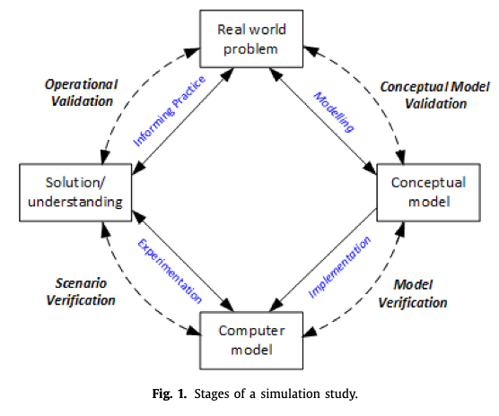
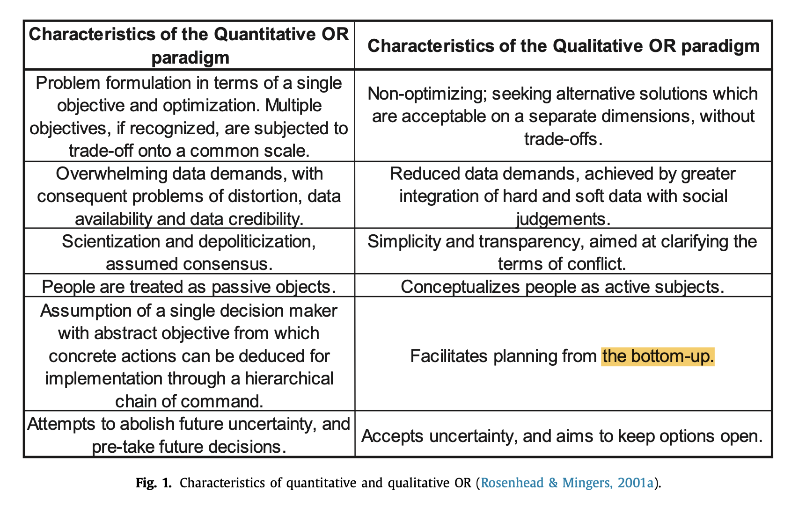
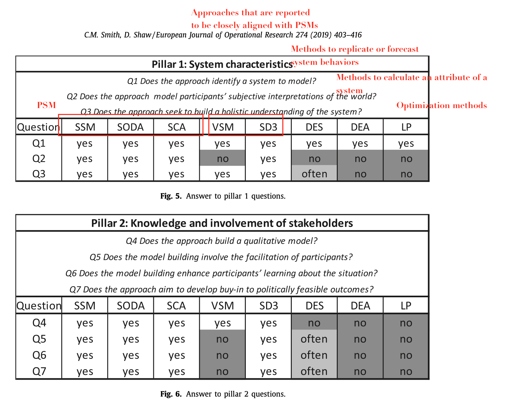

## [Content](#content)

<table>
<tr><td colspan="2"><a href="#related-research-papers-in-or">3. Related research papers in OR</a></td></tr>
<tr><td colspan="2">&emsp;<a href="#building-digital-models">3. 1 Building digital models</a></td></tr>
<tr>
	<td>&emsp;&emsp;<a href=#quantitative-modeling>3.1.x Quantitative modeling approaches</a></td>
	<td>&emsp;&emsp;<a href=#mixed-quantitative-and-qualitative-modeling>3.1.x Mixed quantitative and qualitative modeling approaches</a></td>
</tr>
<tr>
	<td>&emsp;&emsp;<a href=#automatically-generating-simulation-models>3.1.x Automatically generating simulation models</a></td>
</tr>
</table>

[Back to homepage](../papers4dtor.md)

## [Building digital models](#content)
Virtual representation is a set of correlated digital models and supporting data. Therefore, we first discuss the 

Modeling: abstract the real-world EoP by digital models. three types of digital model. Mathematical equations (problem structuring, soft OR.) Simulation model (Hybrid.) AI-based. Directly learn from data. Complexity evaluation.

Supporting data. Inter-departmental, inter-firm. Methods: connecting information systems within a firm; sharing of the key information between firms (information sharing). Difficulties in processing data: missing data. duplicated, inconsistency. information fusion. (Discussion on data fusion, integration, aggregation). What types of data are most useful?

### [Quantitative modeling](#content)
Quantitative models: mathematical formulation + simulation models (data-driven calibration methods)

1. **A review of dynamic vehicle routing problems**. EJOR, 2013. [paper](http://dx.doi.org/10.1016/j.ejor.2012.08.015). *Victor Pillac, Michel Gendreau, Christelle Guéret, Andrés L. Medaglia*

2. **Models for production planning under uncertainty: A review**. IJPE, 2006. [paper](https://doi.org/10.1016/j.ijpe.2005.09.001). *J. Mula, R. Poler, J.P. Garcıa-Sabater, F.C. Lario*.

3. **Taking stock of behavioural OR: A review of behavioural studies with an intervention focus**. EJOR, 2021. [paper](https://doi.org/10.1016/j.ejor.2020.11.031).

4. **The Object-Oriented discrete event simulation modeling: A case study on aircraft spare part management**. WSC, 2015. [paper](https://ieeexplore.ieee.org/document/7408511). *Haobin Li; Yinchao Zhu; Yixin Chen; Giulia Pedrielli; Nugroho A. Pujowidianto*

5. **Tutorial on agent-based modeling and simulation**. WSC, 2005. [paper](https://ieeexplore.ieee.org/abstract/document/1574234). *C.M. Macal; M.J. North*.

6. **Agent-based modeling and simulation**. WSC, 2009. [paper](https://ieeexplore.ieee.org/abstract/document/5429318). *C.M. Macal; M.J. North*.

7. **Introductory Tutorial: Agent-based Modeling And Simulation**. WSC, 2014. [paper](https://ieeexplore.ieee.org/abstract/document/7019874). *C.M. Macal; M.J. North*.

8. **System Dynamics Modeling: Tools for Learning in a Complex World**. California Management Review, 2001. [paepr](https://doi.org/10.2307/41166098. *
John D. Sterman*. 

9. **Hybrid simulation modelling in operational research: A state-of-the-art review**. EJOR, 2018. [paper](https://doi.org/10.1016/j.ejor.2018.10.025). *Sally C. Brailsford , Tillal Eldabi , Martin Kunc , Navonil Mustafee , Andres F. Osorio*. 

> Simulation approaches in manufacturing and business: discrete-event simulation (DES), system dynamics (SD) and agent-based simulation (ABS) 

> An increasing interest in hybrid simulation (defined as models that combined at least two of these approaches) to model complex enterprise-wide systems.

> Bennett (1985) discusses three levels at which different OR methods could be combined. The lowest level, Comparison, involves using two or more methods entirely separately for the purpose of solving different aspects of a problem which could not be tackled by any one method on its own. The next level, Enrichment, aims to enhance one method (the main method) by using elements of another. The highest level, Integration, treats the methods on an equal footing and uses elements of each to generate something to- tally new.

> Most real-world problems and systems are complex, with many different features and characteristics, and very rarely is one single method ideally suited to capture all of them. The modeller who chooses to use only one method is therefore faced with a dilemma: to model the whole problem using one single method, accepting that it makes invalid assumptions or oversimplifies some aspects, or to model only those parts of the problem for which their chosen method is suitable and simply say that the remaining parts are out of scope? The former approach may lead to poor solutions (and bad decisions), but from a practical perspective it may be neither useful nor sensible to study only one aspect of a real-world problem in isolation. This dilemma has also driven the need for hybrid simulation.

> We originally hypothesised that hybrid simulation approaches have become more popular because modern business problems are more complex. However, it may be that business problems were always complex, and simulation modellers have simply become more ambitious about the types of problem that can be tackled. Either way, hybrid simulation is clearly here to stay.

 

10. **Particle Methods for Data-Driven Simulation and Optimization**. In INFORMS TutORials in Operations Research, 2012. [paper](https://doi.org/10.1287/educ.1120.0104). *John R. Birge*. 

> Particle methods have become a common approach to estimate the distribution of an unknown state in a Markov process (i.e., a hidden Markov model) from noisy observations with general nonlinear transitions. 

11. **Maximum Likelihood Estimation by Monte Carlo Simulation: Toward Data-Driven Stochastic Modeling**. Operations Research, 2020. [paper](https://doi.org/10.1287/opre.2019.1978). *Yijie Peng, Michael C. Fu, Bernd Heidergott, Henry Lam*

> -  We propose a new method for estimating un- known parameters of a stochastic model without assuming an analytical likelihood function.
> - We directly fit the underlying stochastic model to the output data, which opens the possibility of extending data-driven ideas to causal stochastic models.
> - We generalize our scheme to efficiently utilize the simulated samples in calculating the MLE for an HMM.

12. **Learning to simulate**. ICLR, 2019. [paper](https://arxiv.org/abs/1810.02513). *Nataniel Ruiz, Samuel Schulter, Manmohan Chandraker*

13. **Learning to Simulate Vehicle Trajectories from Demonstrations**. 2020 IEEE 36th International Conference on Data Engineering (ICDE). [paper](https://ieeexplore.ieee.org/document/9101553). *Guanjie Zheng; Hanyang Liu; Kai Xu; Zhenhui Li*.

### [Mixed quantitative and qualitative modeling](#content) 
1. **The characteristics of problem structuring methods: A literature review**. EJOR, 2019. [paper](https://doi.org/10.1016/j.ejor.2018.05.003). *Chris M. Smith, Duncan Shaw*

> Problem structuring methods (PSMs) are a class of qualitative operational research (OR) modeling approaches.

> Methods associated with quantitative OR follow a more objectivist stance and are better suited to ‘tame’ problems that can be more easily comprehended. In contrast, PSMs take a subjectivist stance (within an interpretivist paradigm) and are suited to ‘wicked’ problems that are difficult to specify. **Problems that has nonprocedural solutions.**

> Such problems are pluralistic (Jackson & Keys, 1984), as stakeholders have divergent views about goals and objectives. The problems exist in dynamic and complex systems that interact with each other (Ackoff, 1979).

> They cannot be exhaustively formulated, every formulation is a statement of a solution, there is no stopping rule, there is no true or false, there is no exhaustive list of operations, there are many explanations for the same problem, every problem is a symptom of another problem, there is no immediate or ultimate test, solutions are ‘one shot’ and every problem is unique. 

> PSMs see problems as systems in which elements are connected by interrelationships rather than static snapshots. 

2. **Soft OR and Practice: The Contribution of the Founders of Operations Research**. Operations Research, 2021. [paper](https://doi.org/10.1287/opre.2020.2051). *Robert G. Dyson, Frances A. O’Brien, Devan B. Shah*.
@TAG modeling
> The motivation for the development of soft OR stemmed from a concern that hard (quantitative) OR could not solve wicked (i.e., ill-structured, complex) problems (Rittel and Webber 1973) or engage effectively with swamp conditions—messy, confusing problems(Scho ̈n1987)

> A set of characteristics of soft OR
> - An ill-defined problem situation (context)
> - The existence of multiple actors or stakeholders with different perspectives and conflicting objectives (context)
> - A high degree of uncertainty, intangibles, and qualitative and limited quantitative data (context)
> - Engagement with and interactions between stake- holders to seek agreement on the nature of the problem and of learning and on actions. This may involve the use of facilitated workshops (real or virtual) (process)
> - Concern for process issues/procedural rationality (process)
> - The use of models as a focus for the discussions that are transparent and understandable. These are typically diagrammatic models such as causal maps, cognitive maps, influence diagrams, decision graphs, and rich pictures (content)

> ... the emergence of mixed soft and hard modelling indicates that hard models can have an important decision support role in such contexts.

> Hence a vicious circle can develop where some academics know more and more about less and less and can become dis- connected from the real world. (This issue has been a concern in the Academy of Management for some years; see, e.g., Vishwanath et al. 2017.) The potential danger of this trend is that much of OR could become ossified, focusing mainly on an historical problem set that has increasingly limited economic or social impact thus denying its heritage.

3. **Combining problem structuring methods with simulation: The philosophical and practical challenges**. Discrete-Event Simulation and System Dynamics for Management Decision Making, Chapter 4, 2014. [paper](https://onlinelibrary.wiley.com/doi/pdf/10.1002/9781118762745). *Kathy Kotiadis and John Mingers*.

4. **Problem structuring methods in action**. EJOR, 2004. [paper](https://doi.org/10.1016/S0377-2217(03)00056-0). *John Mingers, Jonathan Rosenhead*.

### [Automatically generating simulation models](#content)
1. **A Survey on Automatic Model Generation for Material Flow Simulation in Discrete Manufacturing**. 52nd CIRP Conference on Manufacturing Systems, 2019. [paper](https://doi.org/10.1016/j.procir.2019.03.022). *Heiner Reinhardt, Marek Weber, Matthias Putz*.

2. **Challenges for the Automatic Generation of Simulation Models for Production Systems**. 2010 International Simulation Multiconference / Summer Computer Simulation Conference, SCSC. [paper](https://www.db-thueringen.de/servlets/MCRFileNodeServlet/dbt_derivate_00022287/SCSC-10_S445-449.pdf). *Bergmann, Sören; Strassburger, Steffen*

3. **Trends in Automatic Composition of Structures for Simulation Models in Production and Logistics**. WSC, 2019. [paper](https://ieeexplore.ieee.org/document/9004959). *Sigrid Wenzel; Jana Stolipin; Jakob Rehof; Jan Winkels*

4. **Applying model-reconstruction by exploring MES and PLC data for simulation support of production systems**. WSC, 2012. [paper](https://ieeexplore.ieee.org/document/6465069). *András Pfeiffer; Botond Kádár; Gergely Popovics; Csaba Kardos; Zoltán Vén; Lőrinc Kemény; László Monostori*.

5. **Automatic Simulation Model Generation Based on PLC Codes and MES Stored Data**. Procedia CIRP, 2012. [paper](https://doi.org/10.1016/j.procir.2012.07.013). *G.Popovics, A. Pfeiffer, B.Kádár, Z. Vén, L. Kemény, L. Monostori*

6. **Feature Article: Optimization for simulation: Theory vs. Practice**. INFORMS Journal on Computing, 2002. [paper](https://doi.org/10.1287/ijoc.14.3.192.113). *Michael C. Fu*.

7. **An approach to Determine Simulation Model Complexity**. Procedia CIRP, 2016. [paper](https://doi.org/10.1016/j.procir.2016.07.072). *Gergely Popovics, László Monostori*.

## [Combining supporting data](#content)

1. **Multisensor data fusion: A review of the state-of-the-art**. Information Fusion, 2013. [paper](https://doi.org/10.1016/j.inffus.2011.08.001). *Bahador Khaleghi, Alaa Khamis, Fakhreddine O.Karray, Saiedeh N.Razavi*

2. **Data aggregation mechanisms in the Internet of things: A systematic review of the literature and recommendations for future research**. Journal of Network and Computer Applications, 2017. [paper](https://doi.org/10.1016/j.jnca.2017.08.006). *Behrouz Pourghebleh, Nima Jafari Navimipour*.

1. **The Internet of Things and Information Fusion: Who Talks to Who?**. M&SOM, 2021. [paper](https://pubsonline.informs.org/doi/10.1287/msom.2020.0958). *Soroush Saghafian, Brian Tomlin, Stephan Billerc* @TAG integration of data (interfirm); data quality; ownership

> Problem definition: @RQ Autonomous sensors connected through the internet of things (IoT) are deployed by different firms in the same environment. The sensors measure an important operating-condition state variable, but their measurements are noisy, so estimates are imperfect. Sensors can improve their own estimates by soliciting estimates from other sensors. The choice of which sensors to communicate with (target) is challenging because sensors (1) are constrained in the number of sensors they can target and (2) only have partial knowledge of how other sensors operate—that is, they do not know others’ underlying inference algorithms/models. We study the targeting problem, examine the evolution of interfirm sensor communication patterns, and explore what drives the patterns.

> Consider any given sensor $i$, and assume (without loss of generality) that it can select its target from two sensors: a high-quality sensor (labeled $h$) and a lower-quality sensor (labeled $l$). When should sensor $i$ target sensor $h$? When should it target sensor $l$? How does this choice depend on the initial state $s_0$?

2. **In-situ AI: Towards Autonomous and Incremental Deep Learning for IoT Systems**, 2018 IEEE International Symposium on High Performance Computer Architecture. [paper](https://ieeexplore.ieee.org/stamp/stamp.jsp?tp=&arnumber=8327001). *Mingcong Song; Kan Zhong; Jiaqi Zhang; Yang Hu; Duo Liu; Weigong Zhang; Jing Wang; Tao Li*

> Rather than constantly moving a tremendous amount of raw data to the Cloud, it would be beneficial to leverage the emerging powerful IoT devices to perform the inference task.
> - Two factors in the real IoT systems: data is dynamic and unlabeled. 

> @RQ Nevertheless, the statically trained model could not efficiently handle the dynamic data in the real in-situ environments, which leads to low accuracy. Moreover, the big raw IoT data challenges the traditional supervised training method in the Cloud.

> We propose In-situ AI, the first Autonomous and Incremental computing framework and architecture for deep learning based IoT applications. We equip deep learning based IoT system with autonomous IoT data diagnosis (minimize data movement), and incremental and unsupervised training method (tackle the big raw IoT data generated in ever-changing in-situ environments).

> The result shows:
> - (1) a tradeoff exists between fast response time and energy-efficiency; 
> - (2) latency and energy-efficiency are two key metrics for inference task, while energy-efficiency is the only design concern for the diagnosis task.

3. **Application of IoT-Aided Simulation to Manufacturing Systems in Cyber-Physical System**. Machines, 2019. [paper](https://doi.org/10.3390/machines7010002). *Yifei Tan, Wenhe Yang, Kohtaroh Yoshida, Soemon Takakuwa*

> @RQ Issues such as the reception of real-time data from the IoT, as well as the conversion and inputting of the data into a simulation model have not yet been completely solved. Even though some general roadmaps and frameworks have been proposed, it is still not clear what kind of data and information must be integrated.

> When constructing a DT, a specific framework to guide the process of extracting the necessary data from the physical system and a scheme for entering these data into the cyber-side simulation model are required.

