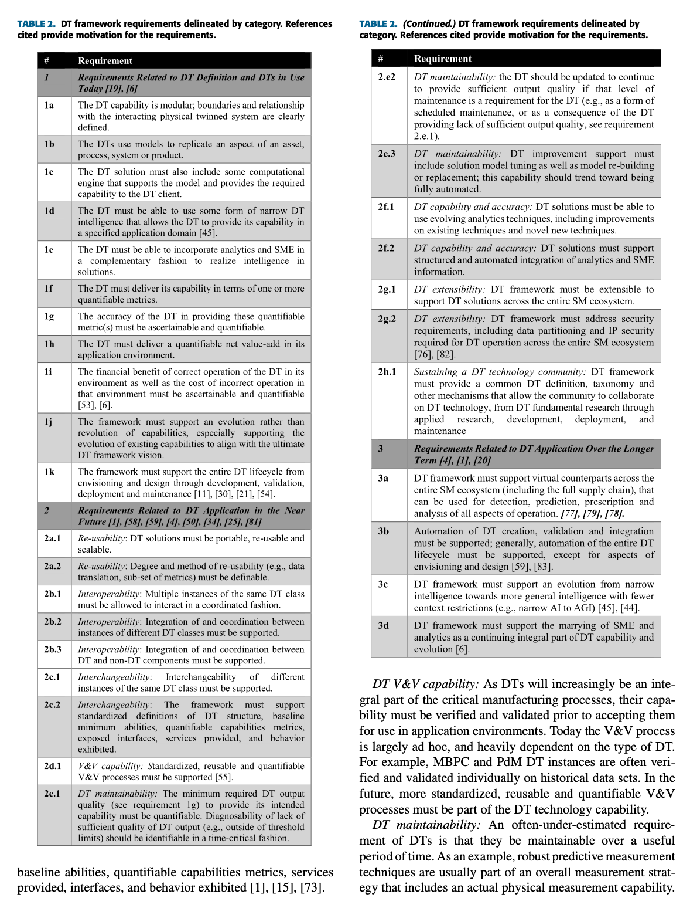

# Technology roadmap for DT

##  X-axis: scope of DT

> Accenture, tech vision 2021: Have ecosystem-scale thinking lead digital twin strategies.Target large systems as the long-term target digital twins. Think entire offices, supply chains, and more. Use individual twins as a means to gain greater visibility into larger collaborations.

- product-level: 产品级
- firm-level: 工厂/企业级
- industry-level: 产业级 公司间/供应链
- world-level: 世界级 跨产业

## Y-axis: integration level of DT

**Integration level**: the extent of integration of data, intelligence (data analytics, simulation), and human.

- Level 1: life-cycle data
- Level 2: life-cycle data
- Level 3: life-cycle data
- Level 4: life-cycle data

## Technology road map

- Stage 1: What-if simulation
- Stage 2: real-time
- Stage 3: 
- Stage 4: 

|  | Product-level | Firm-level | Industry-level  | World-level |
| :----:  | :----: | :----: | :----: | :----: |
| level 1 | stage1 |        |        |        |
| level 2 |        | stage2 |        |        |
| level 3 |        |        | stage3 |        |
| level 4 |        |        |        | stage4 |

## Reference
1. **A Requirements Driven Digital Twin Framework: Specification and Opportunities**. IEEE Access, 2020. [paper](https://ieeexplore.ieee.org/document/9109299). *James Moyne; Yassine Qamsane; Efe C. Balta; Ilya Kovalenko; John Faris; Kira Barton; Dawn M. Tilbury*

> The DTs will be more integrated (vertically and horizontally), will eventually need to be dynamically created, configured, and verified and validated, and operate in an integrated environment that extends beyond the ‘‘four-walls’’ to the entire ecosystem [1], [4], [5]. The DTs will take advantage of advancements in analytics, data, and understanding to provide higher quality and more expansive capabilities. They will continue to use but will better integrate SME (Subject-Matter-Expertise). from the integration of DT information and capabilities vertically and horizontally [40], [49], [50], [58], [59], [64]–[66]. These requirements of support for proliferation, integration, coordination, flexibility and adaptation suggests the need for a DT framework to support typical roll-out software capabilities such as re-use, interoperability and interchangeability, but also more advanced and futuristic software ideas such as automatic DT creation, validation, maintenance and learning [59], [67].

